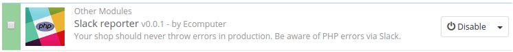

# Prestashop Slack reporter

Developer-oriented Prestashop plugin to get notified about PHP errors in a production website via Slack.

## Disclaimer

This plugin is unmature. In fact, you still have to modify the source code in order to make it work.
We are willing to work on make it better and usabe on our free time, but any pull request will be welcome!

Help us keeping this plugin free as in speech, and free as in beer.